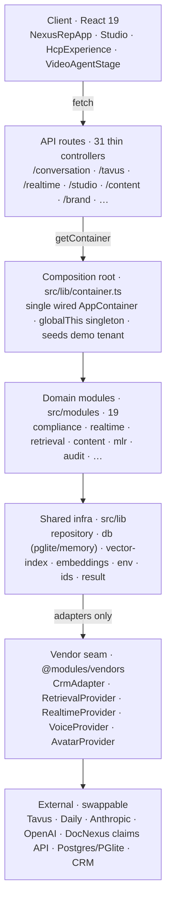
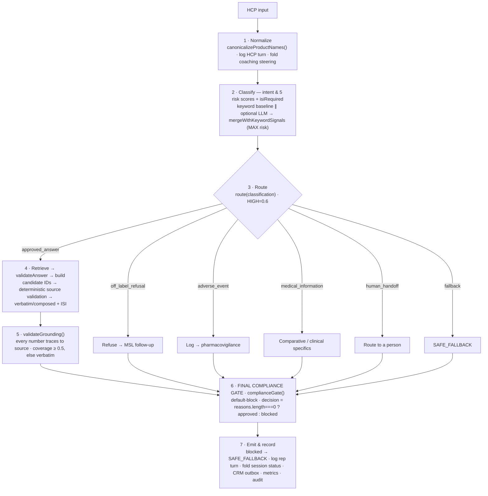
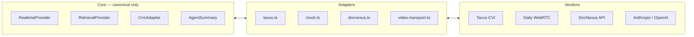

# NexusRep — Architecture

> A map of the whole system: the stack, the modular-monolith layering, the runtime
> compliance pipeline, all 19 modules, persistence, the vendor seam, and the two-UI
> frontend. Companion to [`WALKTHROUGH.md`](./WALKTHROUGH.md) (living build status),
> [`NEXUSREP_IMPLEMENTATION_BRIEF.md`](./NEXUSREP_IMPLEMENTATION_BRIEF.md) (product brief),
> and the root [`CLAUDE.md`](../CLAUDE.md) (agent/compliance rules).
>
> A visual, navigable version of this document is also published as an Artifact.

**At a glance:** ~16.7k lines of TS/TSX · 19 domain modules · 31 API routes ·
38 Vitest files (~260 cases) · 6 Playwright E2E specs · **1 compliance gate**.

---

## 1. What NexusRep is

NexusRep is an AI-first pharma **AI Rep Studio**. Brands **build → train → approve →
launch → improve** a compliant AI representative that talks to healthcare professionals
(HCPs). It is the pharma-specific orchestration layer that links targeting, approved
content, compliant conversation, auditability, analytics, and CRM handoff.

It is **not** a generic CRM, campaign manager, analytics dashboard, or avatar vendor —
those are commodities it wires together behind adapters.

The demo tenant is **J&J / Milvexian** — an investigational oral Factor XIa inhibitor in
cardiology (US LIBREXIA Phase 3). Because it is *investigational*, clinical specifics
(dosing, safety, trial data) never get a generated answer; the rep routes them to Medical
Information. Everything brand-specific lives in one swappable `BrandProfile`.

---

## 2. The core product loop

```
Build the rep → Train the rep → Choose audience → Launch → Improve from sessions
                     ▲                                            │
                     └────────────────────────────────────────────┘
```

Monitoring surfaces sit *around* the loop, not at its center: **Overview, Sessions,
Analytics, Follow-ups**.

**In the codebase**, the conceptual loop maps onto real surfaces: the Studio tabs are
`Build · Agent · Pitch & Script · Training · Rules · Readiness`; **Audience** and
**Launch** live in the shell nav; “Improve” is **Training** plus **Sessions → Coach**.

---

## 3. Two AI roles — never mixed

The single most important design invariant. There are exactly two AI personas.

| | **DocNexus Setup Assistant** | **HCP-facing AI Rep** |
|---|---|---|
| Audience | The **brand user**, inside the Studio | **Doctors**, over the compliance gate |
| Direction | Internal | Outward-facing |
| Behavior | Asks setup questions, infers editable structured values, requests uploads, drafts rules | Approved content only, discloses it is AI, stays on-label, delivers ISI verbatim |
| Risk handling | n/a | Refuses off-label; AE → pharmacovigilance; routes to MSL / Medical Info / human rep; logs every decision |
| Code | `@modules/setupAssistant` · `inferSetupAnswersFromDocument` | `@modules/realtime` · `ConversationService.turn` |

> ⚠ The Setup Assistant must **never** behave like the rep, and the rep must **never**
> free-form like an assistant.

---

## 4. Technology stack

| Layer | Technology | Notes |
|---|---|---|
| Framework | **Next.js 15** (App Router), **React 19** | Turbopack in dev; all UI client-rendered |
| Language | **TypeScript 5.7**, strict | Node ≥ 20 |
| Canonical data | **PGlite** (in-process WASM Postgres) · in-memory driver (default) | pgvector-ready; one env flag switches |
| Retrieval | In-memory vector index · **Transformers.js** (`Xenova/all-MiniLM-L6-v2`) or deterministic lexical embeddings | index returns candidate IDs only |
| LLMs | **Anthropic SDK** (`claude-opus-4-8`) · OpenAI-compatible · Thinking-Machines · deterministic keyword baseline | classifier + optional grounded composer |
| Realtime / avatar | **Tavus CVI** (custom-LLM) · **Daily** WebRTC (quarantined) · Web Speech API · optional TalkingHead + HeadTTS 3D | swappable behind adapters |
| Content ingest | `pdf-parse` · `jszip` · `pptxgenjs` | PPT/PDF → MLR review → retrieval |
| Quality | **Vitest** (unit + integration) · **Playwright** (E2E + visual regression) · ESLint 9 | |
| Deploy | Render (`nexusrep.onrender.com`) | everything defaults to mocked/in-memory/offline |

---

## 5. Architecture — a modular monolith

API routes are **thin controllers** that call into `src/modules/*`. **Components render;
modules decide.** Business logic never lives in React components or route files, so any
module can later be split into its own service without touching business logic.



**The canonical data flow** collapses to one sentence:

```
Any approved source in
  → one canonical internal data model
  → one controlled, latency-aware agent graph
  → one compliance gate before output
  → any CRM or AI vendor out
```

> **Postgres is truth; the vector index is not.** Retrieval only ever returns candidate
> *IDs*. Source validation and the compliance gate decide eligibility against the canonical
> store. On boot the in-memory vector index is **rebuilt from Postgres** — it is a
> rebuildable cache, never product truth (brief §4).

---

## 6. The runtime turn — the heart

Typed chat (`/api/conversation/turn`) and the voice/video avatar
(`/api/tavus/llm/chat/completions`) converge on the **same** path:
`ConversationService.turn()` → `TurnOrchestrator.handleTurn()`. Latency-aware where safe;
**fail-safe always wins over speed.**



### 6.1 Router precedence (first match wins, `HIGH = 0.6`)

| # | Condition | Route |
|---|---|---|
| 1 | `adverseEventRisk ≥ 0.6` | `adverse_event` |
| 2 | `offLabelRisk ≥ 0.6` | `off_label_refusal` |
| 3 | `comparativeClaimRisk ≥ 0.6` | `medical_information` |
| 4 | `intent === "human_request"` | `human_handoff` |
| 5 | `medicalInfoRisk ≥ 0.6` | `medical_information` |
| 6 | `intent === "other" \|\| confidence < 0.6` | `fallback` |
| 7 | otherwise | `approved_answer` |

Investigational + coaching-`blockedTopics` guardrails can only **narrow** a route toward
Medical Information — never widen it.

### 6.2 The classifier

- **Keyword baseline** (`classify`, `classifier.ts`) — whole-word term lists (AE symptom vs
  AE report+cue, off-label, comparative, prompt-injection, human/MSL, intent). Always on,
  `$0`, offline. The fail-safe floor. Brand product names are injected via
  `configureClassifierLexicon`.
- **Optional LLM** (`claude` / `openai` / `thinking-machines`) — better nuance (report vs
  question, comparative vs anatomy, negation, garbled names).
- **Merge** (`mergeWithKeywordSignals`) — keep the LLM's `intent`/`confidence`, take
  `Math.max` of **every** risk score, OR of `isiRequired`. **Risk is monotonic upward** —
  it can never be lowered by the merge. Keyword recovery only fires when there is no high
  safety risk, so it can't undo a confident LLM medical-information escalation.

Signals produced: `intent` · `confidence` · `offLabelRisk` · `adverseEventRisk` ·
`medicalInfoRisk` · `promptInjectionRisk` · `comparativeClaimRisk` · `isiRequired`.

### 6.3 The final compliance gate (`complianceGate`, `gate.ts`)

Accumulates blocking reasons; **default-blocks** (`decision = reasons.length === 0 ?
"approved" : "blocked"`). No whitelist. Block reasons:

`prompt_injection_detected` · `ungrounded_response` · `isi_missing` ·
`off_label_in_answer` · `adverse_event_in_answer` · `empty_response`

ISI / off-label / AE checks are scoped to the `approved_answer` route (a refusal or handoff
line is not a product answer, so it needn't carry ISI); **prompt-injection and
empty-response checks apply on every route.** On a block, `TurnOrchestrator.finalize` swaps
the text for `SAFE_FALLBACK` and suppresses any slide before it reaches the doctor.

> **Fail-safe, everywhere.** Classifier error → keyword baseline. No approved block →
> fallback. Ungrounded paraphrase → verbatim source. Gate blocks → safe fallback.
> Unauthenticated avatar traffic → 401. When classification, retrieval, or validation is
> uncertain, the system refuses, escalates, or uses an approved fallback — never guesses.

---

## 7. Module map (19 modules)

Each module owns its domain types, a repository interface, and service logic. Cross-module
access goes only through a module's `index.ts` public surface.

### Compliance core — the outward-facing safety path
| Module | Responsibility | Main export |
|---|---|---|
| `compliance` | Classify, route, ground, and the final gate | `classify` · `route` · `complianceGate` · `validateGrounding` |
| `realtime` | The agent graph: orchestrates a turn and finalizes it fail-safe | `TurnOrchestrator` · `ConversationService` |
| `retrieval` | Candidate IDs → deterministic source validation → re-rank | `RetrievalService.retrieveApproved` |

### Content & governance
| Module | Responsibility | Main export |
|---|---|---|
| `content` | The only thing the rep may speak: approved store + source validator + ingest + composer + presentation | `ContentService` · `GroundedComposer` · `ingestSource` |
| `mlr` | Human review loop: parsed content lands `in_mlr` → approve→`active` (published) or reject→`retired` | `MlrService` · `isMlrActive` |
| `audit` | Append-only event log proving every turn; `seq` survives restarts | `AuditService` · `allOfType()` |

### Conversation record & handoff
| Module | Responsibility | Main export |
|---|---|---|
| `sessions` | Sessions & turns; compliance status derived, never hand-set | `SessionService` · `recordOutcome` |
| `followups` | Auto-created tasks (human / MSL / medical-info / PV); owner from setup answers | `FollowUpService` · `FollowUpType` |
| `crm` | Automated backend handoff via a retrying outbox behind a swappable adapter | `CrmOutbox` · `CrmAdapter` |

### Audience & insight
| Module | Responsibility | Main export |
|---|---|---|
| `audience` | HCP targeting from claims-derived aggregates (no PHI); auditable opportunity math. **Holds the `TargetingService`.** | `TargetingService` · `scoreOpportunity` · `loadCohort` |
| `analytics` | Metrics **derived** from session/CRM/content/audit state — topic mix & compliance rates read the audit trail | `AnalyticsService` · `RuntimeMetrics` |
| `targeting` | *Empty directory* — targeting logic lives inside `audience`. Reserved as a future split point. | — |

### Studio & brand configuration
| Module | Responsibility | Main export |
|---|---|---|
| `aiRepStudio` | Owns the AIRep + persona + readiness model behind the lifecycle; per-rep serialized writes | `StudioService` · `readiness()` |
| `setupAssistant` | Internal assistant: one question at a time; infers editable setup values | `SETUP_QUESTIONS` · `applyAnswer` |
| `rules` | Coaching → scoped draft rules; only active, compliance-cleared rules steer the rep | `generateRule` · `activeSteering` |
| `brand` | Single data-driven source of all brand/campaign config; chat answers merge in; computed “Day N of M” | `BrandProfile` · `resolveBrandProfile` · `toPublicBrand` |

### Infra seam & platform stubs
| Module | Responsibility | Main export |
|---|---|---|
| `vendors` | The sole registry resolving realtime/voice/avatar/CRM/retrieval providers; no vendor SDK type leaks past an adapter | `getCrmAdapter` · `getRetrievalProvider` · `getRealtimeProvider` |
| `auth` *(stub)* | Brand user vs HCP/doctor role model | `Role` · `Principal` |
| `tenants` *(stub)* | Tenant/brand/campaign isolation model | `Tenant` · `Brand` · `Campaign` |
| `training` *(stub)* | Rehearsal + transcript-coaching types; feeds `rules` | `TrainingSession` · `TrainingComment` |

---

## 8. Persistence — one interface, swappable driver

Every module depends only on a tiny `Repository<T>` interface
(`get · list · insert · update · delete`). The concrete store is a single env switch,
decided once in the composition root.

- **`MemoryRepositoryFactory`** — `Map`-backed, deterministic insertion order (default;
  tests + memory driver).
- **`PgRepositoryFactory`** — PGlite: one table per collection, objects stored as JSON,
  `list` filters via `data::jsonb`, `insert` is an upsert.
- **`AppendOnlyRepository`** — `update`/`delete` throw; corrections are appended, never
  mutated. Used for the audit log at both layers.
- `getRepositoryFactory()` → `env.dataDriver === "postgres" ? PgRepositoryFactory :
  MemoryRepositoryFactory`.

**Restart semantics — seed-if-absent.** Because the Postgres insert is an upsert, blind
re-seeding would *resurrect content MLR reviewers had retired* (a compliance bug). So every
seed is existence-guarded (`if (!await content.getAsset(id)) …`), determinism comes from
stable seeded ids (`newId(prefix, seed)`), the audit `seq` re-seeds from the store's max on
first write (no interleaved trails), and the vector index is rebuilt from every active
answer on boot.

**Branded IDs** (`ids.ts`) — a phantom `unique symbol` tag makes each id its own type
(`Brand<string,"hcp_id">`), so a `BrandId` can never be passed where an `HcpId` is expected;
at runtime they are plain strings. `asId()` casts at trust boundaries; `newId(prefix,
seed?)` mints deterministic-or-random ids.

**`Result<T,E>`** (`result.ts`) — refusals and validation/compliance blocks are returned as
`Ok`/`Err` values rather than thrown, so the orchestrator routes deterministically and
fails safe (e.g. `ContentService.validateAnswer` returns a typed `Err`: `not_active`,
`expired`, `audience_mismatch`, …).

---

## 9. The vendor seam

Core services depend only on canonical NexusRep objects. Vendor-specific vocabulary is
quarantined to exactly the files that *are* the adapter surface.



- The word **“replica”** and the `@daily-co/daily-js` import exist *only* inside the Tavus
  adapter (`tavus.ts`) and client transport (`video-transport.ts`); no “Tavus”/“Daily”
  string appears in any UI component. Adding a vendor = one adapter + one transport, zero
  changes to routes/stages/Studio.
- **The avatar can only speak gated text.** Tavus's persona points its `layers.llm.base_url`
  at `/api/tavus/llm/chat/completions`, which runs the doctor's words through the *same*
  `ConversationService.turn` and streams back **only** the gated `responseText`.
  Fail-closed auth: no `TAVUS_LLM_KEY` → 401; wrong bearer → 401. ASR artifacts
  (`[BLANK_AUDIO]`) → empty reply, nothing logged. The webhook (`recording_ready`) must
  carry the shared key.
- **No patient-level data leaves the building** — by construction. Vendor session context
  is literally `"Product: … Audience: … No patient-level data."`; audience providers return
  claims-derived **HCP-level aggregates only**; the turn context carries only session/hcp
  id, audience, indication, market, the investigational flag, and the text.

---

## 10. Frontend — two UIs from one shell

Next.js App Router, all client-rendered, styled entirely through inline `style` objects
referencing `--dn-*` design tokens (`public/colors_and_type.css` + an inlined subset in
`globals.css` for offline determinism). A `mode` flag switches between the brand console and
the doctor view; `/hcp` is the standalone shareable doctor link.

- **Brand console (Studio).** Shell `NexusRepApp` + left nav rail + header that polls live
  readiness. Studio tabs: `Build` (Setup Assistant chat + section editors + MLR review
  queue + ISI propose/approve) · `Agent` (vendor-neutral gallery + voice & tone; built-in
  fallback = “DocNexus Agent”) · `Pitch & Script` (deck + coachable per-section script) ·
  `Training` (coaching loop + A/B ModelLab → scoped rules) · `Rules` · `Readiness`. Shell
  nav: Overview · Audience · Launch · Sessions · Analytics · Follow-ups · Platform Admin.
- **Doctor view (`HcpExperience`).** Zero internal jargon — no sidebar, no MLR IDs, no
  “compliance gate” language. Screens: invite → conversation → complete. One ask bar +
  “Try:” chips + guided slide-led overview + request buttons (human rep / MSL / **report
  side effect**). **Barge-in**: a monotonic generation counter cancels in-flight speech the
  moment the doctor types or talks. “Rep voice on/off” (the rep's speaker) is deliberately
  distinct from the doctor's mic mute.
- **Vendor-neutral video.** `VideoAgentStage` POSTs `/api/realtime/conversation`, then
  `createVideoTransport(provider)` resolves a provider-keyed registry; the
  `VideoCallTransport` interface speaks canonical `speaker: "rep" | "hcp"`. Optional 3D
  avatar (`LiveAvatar`) falls back to a coded avatar (`RepAvatar`).
- **Brand config** flows through the `useBrand()` hook — fetches `/api/brand` once, caches
  at module scope, broadcasts a `brand-changed` event so every consumer shares one
  `PublicBrand` (the server-only persona/system-prompt is withheld).

---

## 11. Hard rules (non-negotiable, enforced in code)

- **Approved content only** — no generated medical, dosing, efficacy, safety, comparative,
  or promotional claims.
- **Off-label → refuse & route** to Medical Information / MSL.
- **Adverse events → pharmacovigilance** — logged and routed, never narrated over.
- **ISI delivered verbatim** when required (normalized-whitespace substring check at the gate).
- **No patient-level data** in live context or to any AI/avatar/TTS/ASR vendor —
  HCP-level aggregates only.
- **Every response passes the final gate** before output; the gate default-blocks.
- **CRM is an automated backend handoff**, surfaced through Follow-ups — not a manual tab.
- **Fail safe** — uncertain classification/retrieval/validation → refuse, escalate, or
  approved fallback.

---

## 12. Testing

All three layers run offline against deterministic env
(`NEXUSREP_CLASSIFIER=keyword`, lexical embeddings, `NEXUSREP_DEMO_DATE` pinned).

- **Unit (Vitest)** — 38 files, ~260 cases: adapters, normalizers, content versioning, MLR
  status, retrieval filters, response validation, the compliance gate, CRM outbox, rule
  generation/scoping, setup-field inference.
- **Integration** — key flows end-to-end: content→retrieval→gate→output ·
  off-label→refusal→MSL · AE→pharmacovigilance · session-end→follow-up→CRM outbox.
- **E2E & visual (Playwright)** — 6 specs (build, train, train-from-session, compliance,
  audience, launch, follow-ups) + visual baselines that catch `[object Object]`, header
  clipping, hidden tabs, and the doctor view leaking internal terms.

---

## 13. Configuration — one flag per swap

The composition root reads `src/lib/env.ts` and wires accordingly; nothing else branches on
environment. `npm run dev` → everything mocked, in-memory, offline.

| Env var | Default | Switches |
|---|---|---|
| `NEXUSREP_DATA_DRIVER` | `memory` | In-memory ↔ PGlite Postgres (durable when `PGLITE_DATA_DIR` set) |
| `NEXUSREP_CLASSIFIER` | auto → `keyword` | Live classifier: keyword · claude · openai · thinking-machines (auto-picks by which API key exists) |
| `NEXUSREP_COMPOSE` | auto | `deterministic` (verbatim blocks) ↔ `llm` (grounding-validated rephrase) |
| `NEXUSREP_AUDIENCE` | `modeled` | Built-in cohort ↔ live DocNexus claims backend |
| `NEXUSREP_EMBEDDINGS` | auto | `lexical` · `neural` (MiniLM) · `auto`; tests force lexical |
| `NEXUSREP_SEED_HISTORY` | off | Seed demo sessions/follow-ups so a fresh console isn't empty |
| `NEXUSREP_DEMO_DATE` | today | Pins “today” for the computed campaign “Day N of M” |
| `NEXUSREP_RISK_THRESHOLD` | `0.6` | The `HIGH` cutoff used by router + gate |
| `NEXUSREP_GROUNDING_MIN_COVERAGE` | `0.5` | Grounding coverage floor |
| `TAVUS_LLM_KEY` | — | Shared secret the avatar presents to the custom-LLM endpoint; absent → 401 (fail-closed) |
| `TAVUS_API_KEY` | — | Presence flips realtime + avatar defaults to Tavus; else mock providers |

---

## 14. Repository map

```
src/
├─ app/                        # Next.js App Router
│  ├─ layout.tsx · page.tsx    # shell mount + design tokens
│  ├─ hcp/ · spike/            # doctor link · A/V rehearsal page
│  ├─ _app/                    # NexusRepApp, StudioScreen, HcpExperience, data.ts
│  ├─ _components/             # VideoAgentStage, video-transport, SlideView, useBrand
│  └─ api/                     # 31 thin route controllers → modules
├─ modules/                    # 19 domain modules — business logic lives here
│  ├─ compliance/ realtime/ retrieval/    # the runtime turn
│  ├─ content/ mlr/ audit/                # approved content + governance
│  ├─ sessions/ followups/ crm/           # record + handoff
│  ├─ audience/ analytics/                # targeting (in audience) + derived metrics
│  ├─ aiRepStudio/ setupAssistant/ rules/ brand/  # studio + config
│  └─ vendors/ auth/ tenants/ training/   # seam + stubs
├─ lib/                        # shared infra
│  ├─ container.ts             # composition root — wires everything, seeds demo
│  ├─ repository.ts · db/      # Repository<T> + memory/PGlite drivers
│  ├─ vector-index.ts · embeddings.ts
│  └─ env.ts · ids.ts · result.ts · active-call.ts
└─ types/
tests/   # 38 Vitest files     ·     e2e/   # 6 Playwright specs + visual baselines
docs/    # WALKTHROUGH · IMPLEMENTATION_BRIEF · VENDOR_EVAL · demo scripts
```

---

## 15. Why it's built this way

- **One gate, default-block.** A single choke point that blocks unless every reason list is
  empty means a new failure mode can only make things *safer* — no scattered per-feature
  approval logic to keep in sync.
- **Canonical objects, adapters at the edge.** Core services never see a Tavus record or a
  raw CRM payload; swapping a vendor is one adapter file, and the compliance logic is
  untouched.
- **Postgres is truth; the index is a cache.** Retrieval can be fast and approximate because
  it only proposes IDs; eligibility is always re-decided against the canonical store, so a
  stale index can never leak retired content.
- **Keyword floor under every LLM.** The deterministic classifier always runs and the merge
  takes the max risk, so an LLM outage or hallucination can't lower a safety signal —
  compliance never depends on a model being up.
- **Metrics derived, never stored.** Analytics reads the audit trail and live services, so a
  regression moves the number instead of a hand-typed constant staying reassuringly green.
- **No patient data, by construction.** The context object physically cannot carry PHI, and
  audience providers return aggregates only — an architectural guarantee, not a code-review
  reminder.
